# AS_Domain_Watchlist

Author: Arbala Security

For any technical questions, please contact info@arbalasystems.com   

This ARM template will create a Watchlist and a Logic App to work in tandem with one another. The Logic App is intended to be run from an Azure Sentinel alert. It will extract the domains from entities in an alert and add them to the watchlist. You will be able to view, edit, or repurpose the watchlist as you see fit.

#
To configure and deploy this playbook:
 
Open your browser and ensure you are logged into your Azure Sentinel workspace. In a separate tab, open the link to our ARM template on the Arbala Security GitHub Repository:

https://github.com/Arbala-Security/AS_Domain_Watchlist

                                                 

From there, click the “Deploy to Azure” button at the bottom and it will bring you to the Custom Deployment Template.

In the first section:  

* Select the “**Subscription**” and “**Resource Group**” from the dropdown boxes you would like the playbook deployed to.  

In the **Parameters** section:   

**1) Playbook Name**: This can be left as “AS_Domain_Watchlist” or you may change it.  

**2) Workspace Name**: Enter the name of the Azure Sentinel Workspace you are using for deployment.

**3) Watchlist Name**: You may keep the default name or change it to something to better suit your use case.

**4) Watchlist Description**:  Enter a description for your watchlist. 

Towards the bottom, click on “Review + create”. 

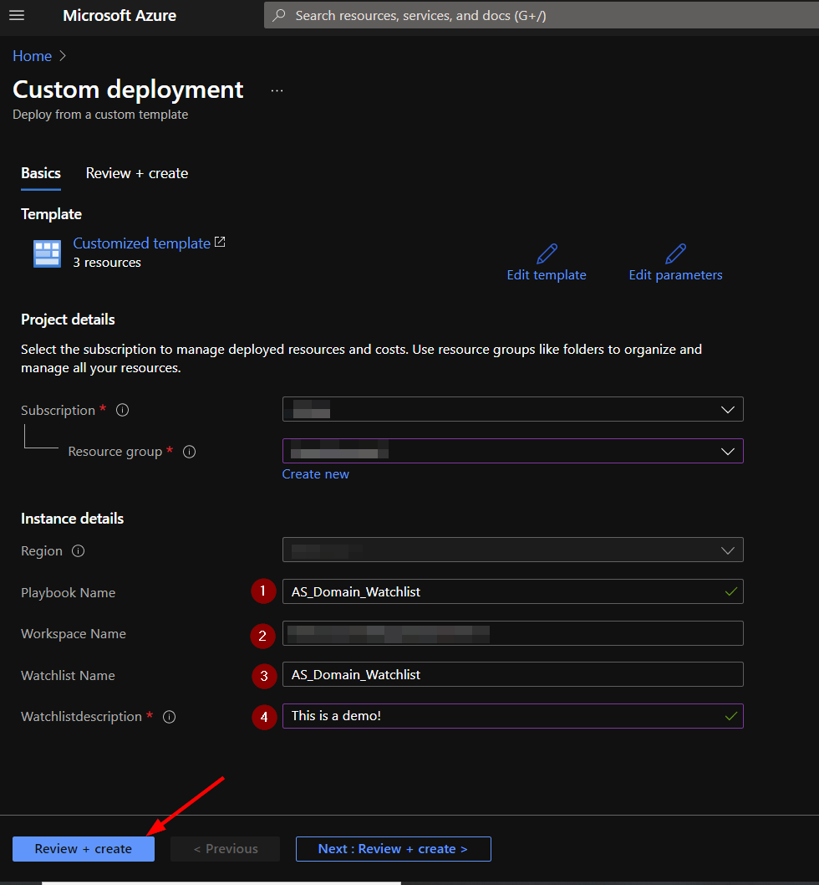

Once the resources have validated, click on "Create".

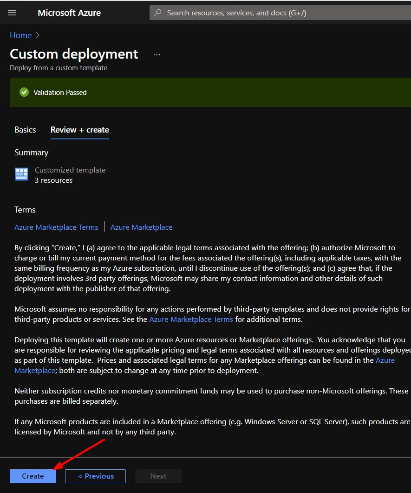

The resources should take around a minute to deploy. Once the deployment is complete, you can expand the "Deployment details" section to view them.
Click the one corresponding to the Logic App.
                                                                                                                             
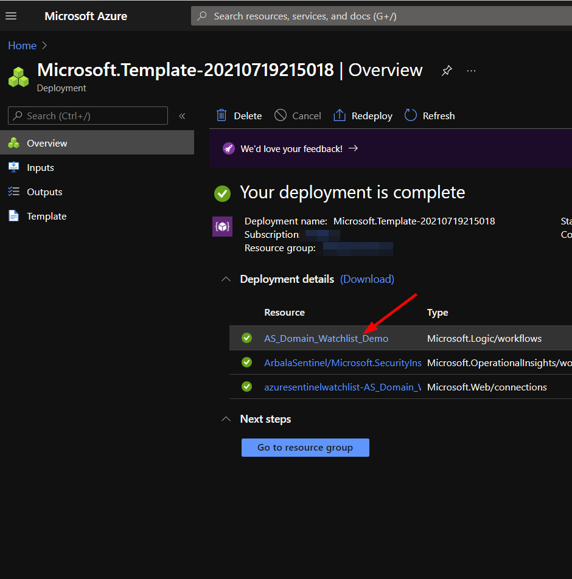
                                                                                                                             
Click on the “Edit” button. This will bring us into the Logic Apps Designer.
                                                                                                                             
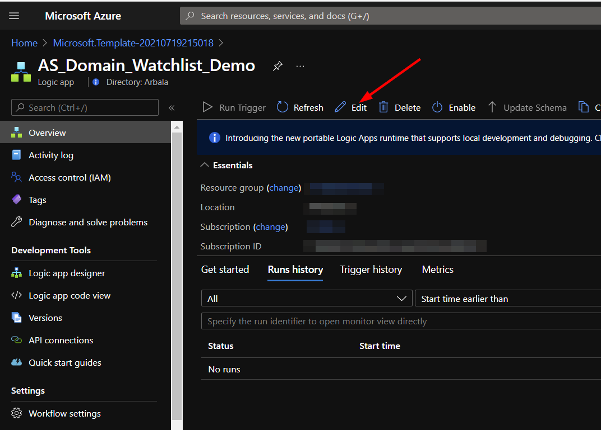

Click on the bar labeled “Connections”.

Here you will select the connection with the same name as your Playbook.                                                                                                         
                                                                                                                             
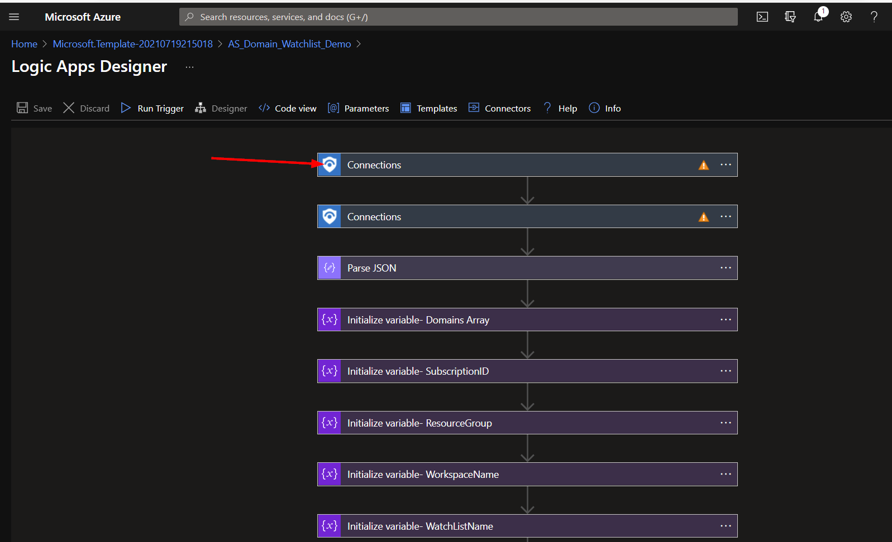

Here you will select the connection with the same name as your Playbook. Click on the exclamation  icon.                          
                                                                                                                             
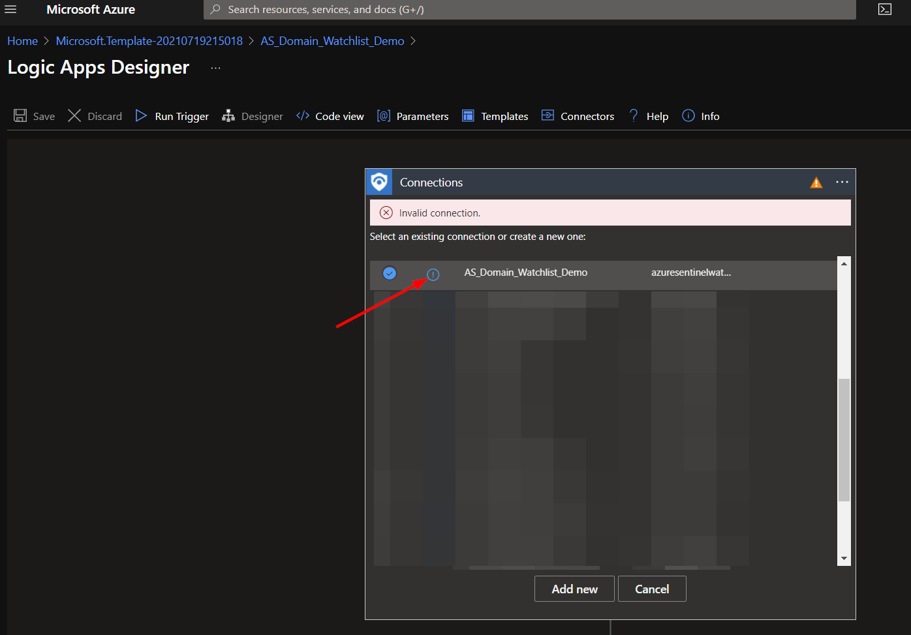                                                                                                                           
                                                                                                                             
You will be prompted to authorize the connection with your Azure account.
                                                                                                                             
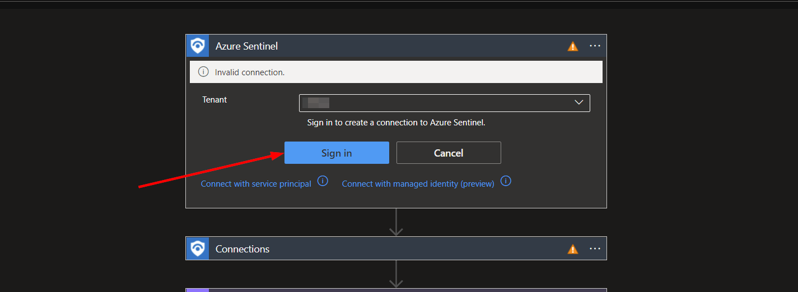 
 
 Once the connection is set up, you will need to check the other connectors requiring an Azure Sentinel connection
                                                                                             
One of the two remaining connections is directly below the first. Check for the indicated display. You may need to unselect and then reselect the desired connection after authorizing the first for it to be recognized as valid.
                                                                                                                             
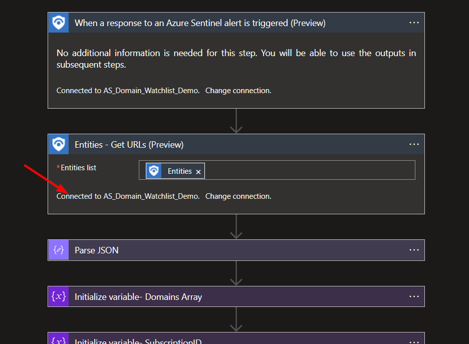                                                                                                                                     

The remaining connection is inside the For Loop as indicated. Repeat the same process here.                                       
                                                                                                                             
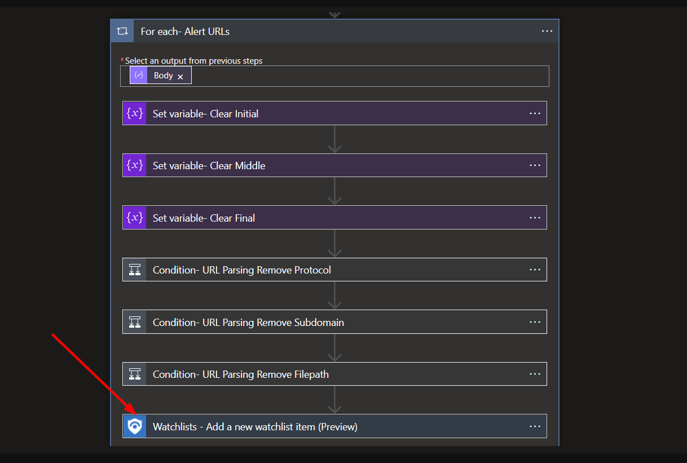                                                                                                                               

#
To run this playbook on an alert in Azure Sentinel, navigate to "Incidents" under "Threat Management" in the left-hand menu.

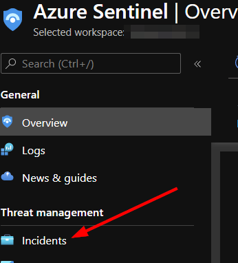

From there you can select an incident that has one or more account entities.

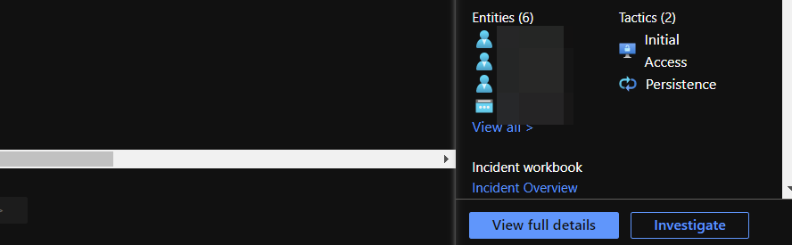

Click the "View full details" button in the bottom right-hand corner.

In the middle window, scroll to the right and click "View playbooks".

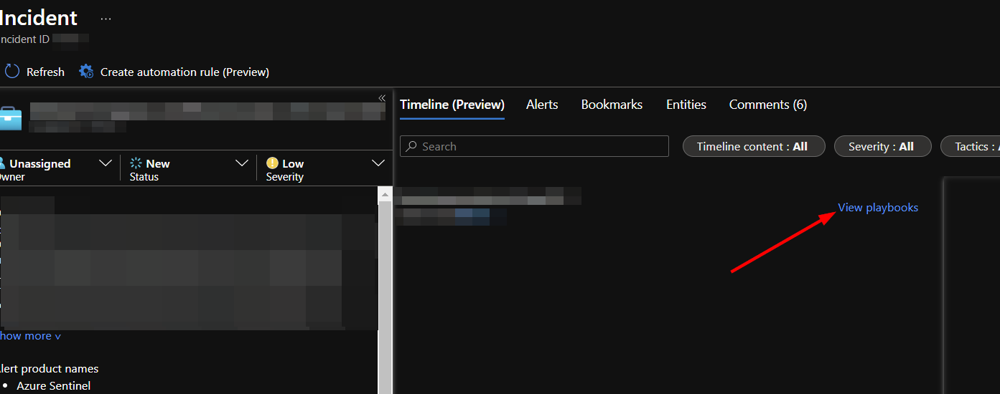

Find the AS_Domain_Watchlist playbook and click run.

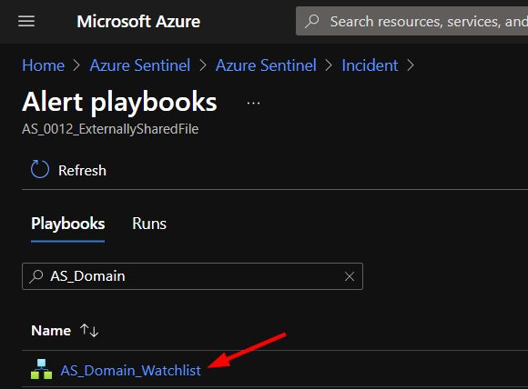                                                                                                               
